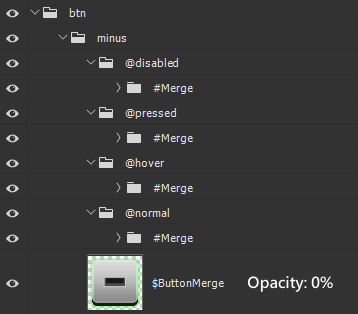

# Game UI Image Material Auto-Slicing Script Instructions

[中文版本](README.zh.md)

## Applicable Scenarios
This script is designed for the automatic slicing of game UI image materials. It is particularly useful for ensuring that image materials for the same button in different states (such as normal, hover, pressed, disabled) maintain the same size, facilitating subsequent application in game engines.

## Placement
Place this script in the Photoshop `\Presets\Scripts` folder to execute it within Photoshop.

## Script Execution Order

1. **Create a Temporary File**: Create a duplicate of the current file.

2. **Delete Excluded Layer Groups**: Remove top-level layer groups with names containing `!` and all invisible top-level layer groups, including their subgroups.

3. **Merge `#` Layer Groups and Process `$` Layers**: Merge all layers within layer groups whose names contain `#`, and copy layers starting with `$` into the same level `@` layer groups.

4. **Rename and Move `@` Layer Groups**: Rename layer groups containing `@`, move them to the top level, and remove the `@` symbol.

5. **Remove Empty Layer Groups**: Delete all empty layer groups.

6. **Convert to Smart Object and Resize Image**: Convert the top-level layer groups to smart objects and resize the image to ensure even dimensions.

7. **Save, Clean Up, and Complete**: Save the image as a PNG file according to the layer names and organize them based on specific rules. Then close and delete the temporary file, completing the process.

## Symbol Explanation

  
  

- **"@"**: Indicates that this layer group needs to be exported, and the exported image name will combine with its parent layer group name. For example, the `@hover` layer group will be exported as `btn_minus_hover.png`.

- **"#"**: Indicates that this layer group will be merged to ensure it does not affect the exported image. For example, the `#Merge` layer group will merge all its internal layers before exporting the image.

- **"!"**: Indicates that this layer group will be ignored during export and will not appear in the final exported images.

- **"$"**: Indicates that this layer will be copied into the same level `@` layer groups and subsequently converted into a smart object in the following steps to ensure consistent image dimensions across multiple variants. For example, the `$ButtonMerge` layer will be copied into all the same level `@` layer groups.

## Exported Image Naming Rules

The exported images will be named by combining the `@` marked layer group name with its parent layer group name. For example, if the parent layer group is named `btn` and the `@` marked layer group is `hover`, the final exported image name will be `btn_hover.png`. Based on the example in the attached images, the final generated file names are as follows:

- `btn_minus_disabled.png`
- `btn_minus_hover.png`
- `btn_minus_normal.png`
- `btn_minus_pressed.png`

## Exported Image Size Rules

The script will automatically adjust the size of the exported images to ensure the width and height are even numbers. If the original image dimensions are odd numbers, it will automatically add 1 pixel.

## Post-Export File Auto-Classification Structure

The exported images will be automatically classified based on the suffixes in their names:

- **Locale**: Categorized by different languages (e.g., CNY, ENU).
- **num_**: Files with numeric names (e.g., 55, number_48).
- **Common**: Files that do not match other categories.

To modify the classification rules, users can edit the `determineFolder` function in the script to change the classification logic.
