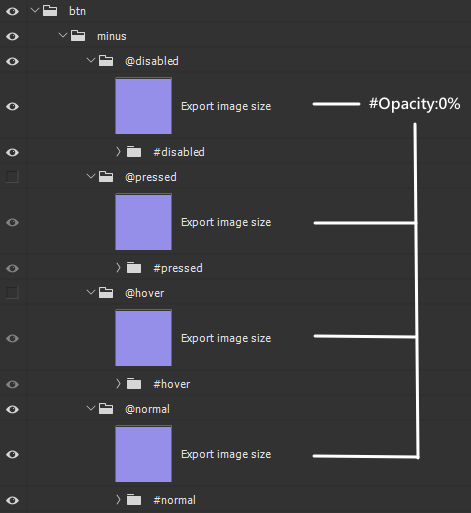

# Game UI Image Material Auto-Slicing Script Instructions

🇨🇳 [中文版本](README.zh.md)

## Applicable Scenarios
This script is designed for the automatic slicing of game UI image materials. It is particularly useful for ensuring that image materials for the same button in different states (such as normal, hover, pressed, disabled) maintain the same size, facilitating subsequent application in game engines.

## Placement
Place this script in the Photoshop `\\Presets\\Scripts` folder to execute it within Photoshop.

## Script Execution Order

1. **Create Temporary File**: Create a duplicate of the current file.
   
2. **Merge `#` Layer Groups**: Merge all layers within layer groups that have `#` in their name.
   
3. **Rename and Move `@` Layer Groups**: Rename layer groups containing `@`, move them to the top level, and remove the `@` symbol.
   
4. **Remove Empty Layer Groups**: Delete all empty layer groups.
   
5. **Convert to Smart Object**: Convert top-level layer groups into smart objects for further processing.
   
6. **Adjust Image Size**: Adjust the dimensions of the smart object, ensuring the width and height are even numbers.
   
7. **Save as PNG**: Save the image as a PNG file based on the layer names, and classify them according to specific rules.
   
8. **Clean Up and Complete**: Close and delete temporary files, completing the process.

## Symbol Explanation

  
  

- **"@"**: Indicates that this layer group should be exported, and the exported image name will combine with the name of its parent layer group. For example, the layer group `@hover` will be named `btn_minus_hover.png` after export.
   
- **"#"**: Indicates that this layer group will have its layers merged to ensure that the exported image is not affected. For example, the layer group `#disabled` will merge all internal layers before exporting the image.
   
- **"!"**: Indicates that this layer group will be ignored during export and will not appear in the final exported images.

## Exported Image Naming Rules

The exported images will be named by combining the `@` marked layer group name with its parent layer group name. For example, if the parent layer group is named `btn` and the `@` marked layer group is `hover`, the final exported image name will be `btn_hover.png`. Based on the example in the attached images, the final generated file names are as follows:

- `btn_minus_disabled.png`
- `btn_minus_hover.png`
- `btn_minus_normal.png`
- `btn_minus_pressed.png`

## Exported Image Size Rules

The script will automatically adjust the size of the exported images to ensure the width and height are even numbers. If the original image dimensions are odd numbers, it will automatically add 1 pixel.

## Post-Export File Auto-Classification Structure

The exported images will be automatically classified based on the suffixes in their names:

- **Locale**: Classified by different languages (e.g., CNY, ENU).
- **num_**: Files with numeric names.
- **Common**: Files that do not match other classifications.

To modify the classification rules, users can edit the `determineFolder` function in the script to change the classification logic.
