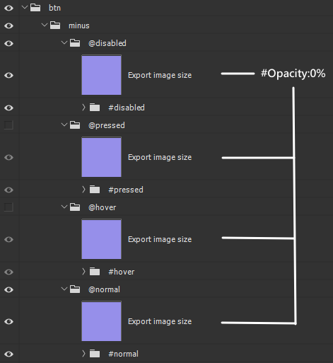
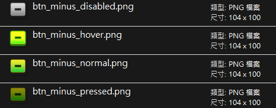

# 遊戲UI圖片素材自動切圖腳本說明

en [English Version](README.md)

## 適用場景
此腳本適用於遊戲UI圖片素材的自動切圖，特別適合用於確保同一個按鈕在不同狀態下（如正常、懸停、按下、禁用）的圖片素材保持相同尺寸，方便後續在遊戲引擎中的應用。

## 放置位置
將此腳本放置於 Photoshop 的 `\Presets\Scripts` 資料夾中，以便在 Photoshop 中執行。

## 腳本執行順序

1. **創建臨時文件**：創建當前文件的副本。

2. **合併 `#` 圖層組**：合併名稱中包含 `#` 的圖層組內的所有圖層。

3. **重命名並移動 `@` 圖層組**：將包含 `@` 的圖層組重命名並移動到頂層，同時移除 `@` 符號。

4. **移除空白圖層組**：刪除所有空白的圖層組。

5. **轉換為智慧型物件**：將頂層的圖層組轉換為智慧型物件，便於進一步處理。

6. **調整圖像大小**：調整智慧型物件的圖像尺寸，調整寬高為偶數。

7. **保存為PNG**：根據圖層名稱將圖像保存為PNG文件，並按規則進行分類。

8. **清理與完成**：關閉並刪除臨時文件，完成處理。
## 符號解釋

  
  

- **"@"**：表示這個圖層組需要導出，且導出的圖片名稱會與其父圖層組名稱結合。例如，圖層組 `@hover` 在導出後會被命名為 `btn_minus_hover.png`。

- **"#"**：表示這個圖層組將合併圖層，以確保不會影響導出的圖片效果。例如，圖層組 `#disabled` 會合併內部所有圖層後導出圖片。

- **"!"**：表示這個圖層組在導出時將被忽略，不會出現在最終導出的圖片中。

## 導出後圖片命名規則

導出的圖片會依照 `@` 標記圖層組名稱與其父圖層組名稱結合。例如，假設父圖層組名為 `btn`，而 `@` 標記圖層組為 `hover`，那麼最終導出的圖片名稱將為 `btn_hover.png`。依照附圖中的例子，最終生成的文件名稱如下：

- `btn_minus_disabled.png`
- `btn_minus_hover.png`
- `btn_minus_normal.png`
- `btn_minus_pressed.png`

## 導出圖片尺寸規則

腳本會自動調整導出的圖片尺寸，確保寬高為偶數。如果原始圖像的寬高為奇數，則會自動增加1像素。

## 導出後檔案自動分類結構

導出的圖片會根據名稱中的後綴進行自動分類：

- **Locale**：根據不同語言（如 CNY, ENU）分類。
- **num_**：包含數字命名的文件。
- **Common**：未匹配其他分類的文件。

如需修改分類規則，用戶可以編輯腳本中的 `determineFolder` 函數來更改分類邏輯。
